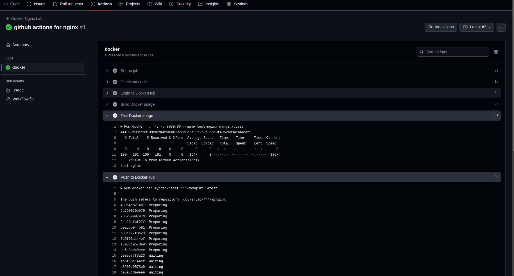

# Github Actions with Docker and Nginx 

Here’s a beginner-friendly and organized documentation for your GitHub Actions Docker Lab setup. This guide explains the structure, files, and workflow step-by-step, along with a diagram to help visualize the process.

---

## **GitHub Actions Docker Lab Documentation**

This project demonstrates how to use GitHub Actions to build, test, and push a Docker image containing an Nginx web server serving a simple HTML page. The workflow is triggered when code push  into the `main` branch.

---

### **Project Structure**

```
your-repository/
├── .github/
│   └── workflows/
│       └── docker.yml          # GitHub Actions workflow file
├── html/
│   └── index.html              # Simple HTML file served by Nginx
├── nginx.conf                  # Nginx configuration file
└── Dockerfile                  # Dockerfile to build the Nginx image
```

---

### **Files Explained**

#### 1. **`html/index.html`**
This is a simple HTML file that will be served by the Nginx web server.

```html
<!DOCTYPE html>
<html>
<head>
    <title>GitHub Actions Docker Lab</title>
</head>
<body>
    <h1>Hello from GitHub Actions!</h1>
    <p>This is a Docker lab using Nginx.</p>
</body>
</html>
```

- **Purpose**: Displays a greeting message when accessed via the Nginx server.

---

#### 2. **`nginx.conf`**
This file configures the Nginx server to serve the `index.html` file.

```nginx
server {
    listen 80;
    server_name localhost;
    location / {
        root /usr/share/nginx/html;
        index index.html;
    }
}
```

- **Purpose**: Configures Nginx to listen on port 80 and serve the `index.html` file from the `/usr/share/nginx/html` directory.

---

#### 3. **`Dockerfile`**
This file defines the Docker image. It uses the official Nginx image and copies the `index.html` and `nginx.conf` files into the image.

```dockerfile
# Use the official Nginx image as the base image
FROM nginx:alpine

# Copy the custom Nginx configuration file
COPY nginx.conf /etc/nginx/conf.d/default.conf

# Copy the HTML file to the Nginx web root directory
COPY html/index.html /usr/share/nginx/html/index.html

# Expose port 80 for the web server
EXPOSE 80

# Start Nginx when the container runs
CMD ["nginx", "-g", "daemon off;"]
```

- **Purpose**: Builds a Docker image with Nginx serving the `index.html` file.

---

#### 4. **`.github/workflows/docker.yml`**
This is the GitHub Actions workflow file. It automates the process of building, testing, and pushing the Docker image to DockerHub.

```yaml
name: Docker Nginx Lab
on:
  push:
    branches:
      - main

jobs:
  docker:
    if: github.event.pull_request.merged == true
    runs-on: ubuntu-latest
    steps:
      # Checkout code
      - name: Checkout code
        uses: actions/checkout@v4

      # Login to DockerHub
      - name: Login to DockerHub
        uses: docker/login-action@v3
        with:
          username: ${{ secrets.DOCKER_USERNAME }}
          password: ${{ secrets.DOCKER_PASSWORD }}

      # Build Image
      - name: Build Docker image
        run: docker build -t mynginx:test .

      # Test Image
      - name: Test Docker image
        run: |
          docker run -d -p 8080:80 --name test-nginx mynginx:test
          sleep 5
          curl http://localhost:8080 | grep "Hello from GitHub Actions"
          docker stop test-nginx

      # Push Image
      - name: Push to DockerHub
        run: |
          docker tag mynginx:test ${{ secrets.DOCKER_USERNAME }}/mynginx:latest
          docker push ${{ secrets.DOCKER_USERNAME }}/mynginx:latest
```

---

### **Workflow Explained**

#### **Trigger**
- The workflow is triggered when a pull request is **closed** and **merged** into the `main` branch.

#### **Jobs**
1. **Checkout Code**:
   - The `actions/checkout@v4` action checks out the repository code so the workflow can access it.

2. **Login to DockerHub**:
   - The `docker/login-action@v3` action logs into DockerHub using credentials stored in GitHub Secrets (`DOCKER_USERNAME` and `DOCKER_PASSWORD`).

3. **Build Docker Image**:
   - The `docker build -t mynginx:test .` command builds the Docker image using the `Dockerfile` in the repository.

4. **Test Docker Image**:
   - The image is tested by running a container and checking if the Nginx server serves the correct HTML content.
   - Steps:
     - Run the container in detached mode: `docker run -d -p 8080:80 --name test-nginx mynginx:test`.
     - Wait for 5 seconds to ensure the server is up: `sleep 5`.
     - Use `curl` to fetch the HTML content and verify it contains "Hello from GitHub Actions".
     - Stop the container: `docker stop test-nginx`.

5. **Push to DockerHub**:
   - The image is tagged with the DockerHub username and pushed to DockerHub.
   - Steps:
     - Tag the image: `docker tag mynginx:test ${{ secrets.DOCKER_USERNAME }}/mynginx:latest`.
     - Push the image: `docker push ${{ secrets.DOCKER_USERNAME }}/mynginx:latest`.

---

### **Diagram of the Workflow**

```plaintext
GitHub Repository
       |
       v
Pull Request Merged into `main`
       |
       v
GitHub Actions Workflow Triggered
       |
       v
+-----------------------------+
| 1. Checkout Code            |
+-----------------------------+
       |
       v
+-----------------------------+
| 2. Login to DockerHub       |
+-----------------------------+
       |
       v
+-----------------------------+
| 3. Build Docker Image       |
+-----------------------------+
       |
       v
+-----------------------------+
| 4. Test Docker Image        |
+-----------------------------+
       |
       v
+-----------------------------+
| 5. Push Image to DockerHub  |
+-----------------------------+
```

---

### **Steps to Set Up**

1. **Create the Repository**:
   - Create a new GitHub repository and add the files (`index.html`, `nginx.conf`, `Dockerfile`, and `docker.yml`).

2. **Set Up DockerHub Secrets**:
   - Go to your GitHub repository → Settings → Secrets and variables → Actions.
   - Add two secrets:
     - `DOCKER_USERNAME`: Your DockerHub username.
     - `DOCKER_PASSWORD`: Your DockerHub password or access token.

3. **Create a Pull Request**:
   - Make changes in a branch and create a pull request to the `main` branch.
   - Merge the pull request to trigger the workflow.

4. **Check the Workflow**:
   - Go to the "Actions" tab in your repository to see the workflow running.
   - Once completed, check DockerHub to see the pushed image.

---



### **Reference**
This doc is inspired by the **Poridhi.io GitHub Actions Lab**, which provides practical examples and hands-on labs for learning GitHub Actions and Docker. For more details, visit [Poridhi.io](https://poridhi.io).


