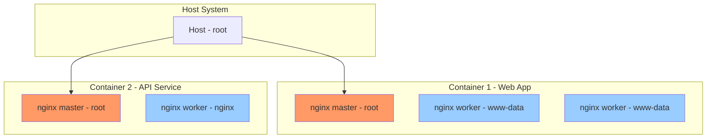

# Lab 02: Isolating Processes

## Understanding Process Isolation

Process isolation is a fundamental concept in container technology. Each container should run as an isolated process, independent of other containers and the host system.

## Key Principles of Process Isolation

### 1. Separate Process Spaces

Each container has its own:
- **PID namespace** - unique process IDs
- **Network namespace** - own network stack
- **Mount namespace** - own filesystem view
- **User namespace** - mapping of user IDs

### 2. Non-Privileged Execution

Containers should not run with unnecessary root privileges:
- Use non-root users inside containers
- Drop capabilities that aren't needed
- Use read-only file systems when possible

## Process Isolation in Containers

### Docker Process Isolation

```bash
# Run a container and check processes from inside
docker run -it --name app-container ubuntu:latest ps aux

# Check processes from host perspective
docker top app-container

# View container's PID namespace
docker inspect --format '{{.State.Pid}}' app-container
```

### Kubernetes Process Isolation

Each pod runs in its own cgroup and namespace:

```yaml
apiVersion: v1
kind: Pod
metadata:
  name: isolated-pod
spec:
  securityContext:
    runAsNonRoot: true
    runAsUser: 1000
  containers:
  - name: app
    image: nginx:latest
    securityContext:
      allowPrivilegeEscalation: false
```

## Nginx Process Isolation Example



## Verification Commands

```bash
# Check PID namespaces
ls -la /var/run/docker.sock
cat /proc/1/cgroup

# View namespace IDs for a container
docker exec app-container cat /proc/1/cgroup

# List all processes visible from inside a container
docker exec app-container ps -ef

# Network isolation check
docker exec app-container ip addr
```

## Security Considerations

1. **Minimize attack surface** - use minimal base images
2. **Run as non-root** - set `USER` directive in Dockerfile
3. **Read-only root filesystem** - use `--read-only` flag
4. **No capability sharing** - drop all capabilities by default
5. **Resource limits** - set CPU/memory constraints

## Process Isolation with runc

For low-level process isolation:

```bash
# Create a container using runc
runc run mycontainer

# Check process tree inside container
runc exec mycontainer ps -ef
```

## Summary

Process isolation ensures that:
- ✅ Each container has its own PID space
- ✅ Containers cannot see or kill processes in other containers
- ✅ Each container has its own network stack
- ✅ File systems are separated
- ✅ Resources can be limited and monitored