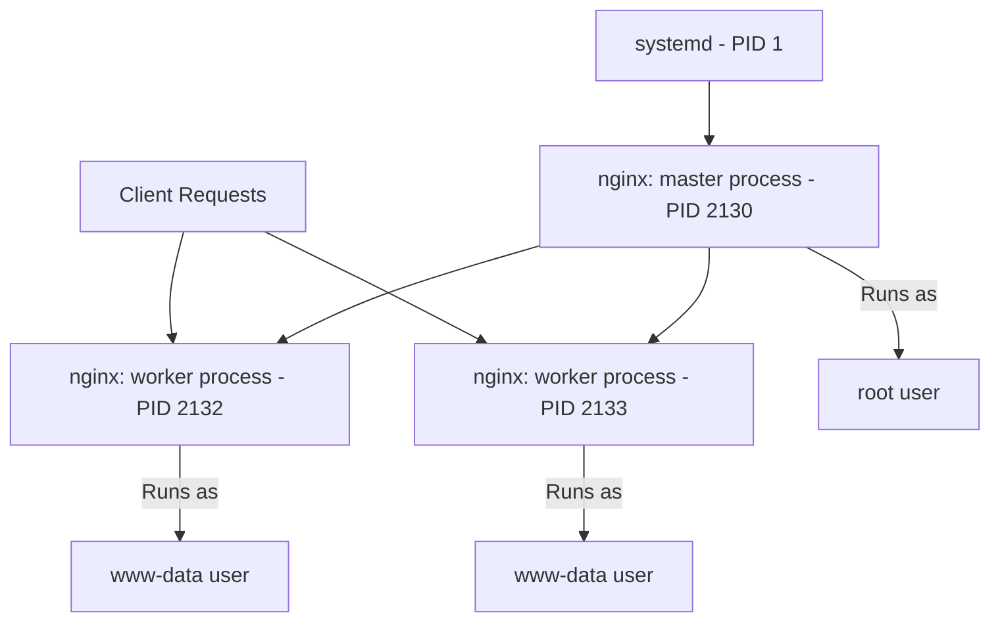

# Lab 01: Nginx Process

## Check Nginx Process

### Hands on Guide

To understand this on a hands-on basis, install an Nginx web server on an Ubuntu machine.

## Install Nginx

To install Nginx, use the following command:

```bash
sudo apt update
sudo apt install nginx -y
```

Once the installation is completed, use the following command to see the Nginx's parent (master) and the child (worker) processes:

```bash
ps -ef | grep [n]ginx
```

### Example Output

```
root      2130     1  0 12:10 ?        00:00:00 nginx: master process /usr/sbin/nginx -g daemon off;
www-data  2132  2130  0 12:10 ?        00:00:00 nginx: worker process
www-data  2133  2130  0 12:10 ?        00:00:00 nginx: worker process
```

### Explanation of the Output

- The **third column** is the **Parent Process ID (PPID)**, and the **second column** is the **Process ID (PID)**.
- **Master process** (PID 2130) runs as root and manages the worker processes.
- **Worker processes** (PID 2132, 2133) run as www-data to handle client requests.

> **Note:** On servers that use systemd, it is the first process that starts at boot, its PID is 1.

## View Process Tree

To see the process in a tree format:

```bash
pstree -p -s $(pgrep -o nginx)
```

### Example Output

```
systemd(1)─┬─nginx(2130)─┬─nginx(2132)
                         └─nginx(2133)
```

Here, systemd is the root parent process of the Ubuntu server, so the PID is 1.

## Nginx Process Architecture


