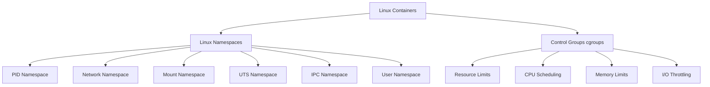
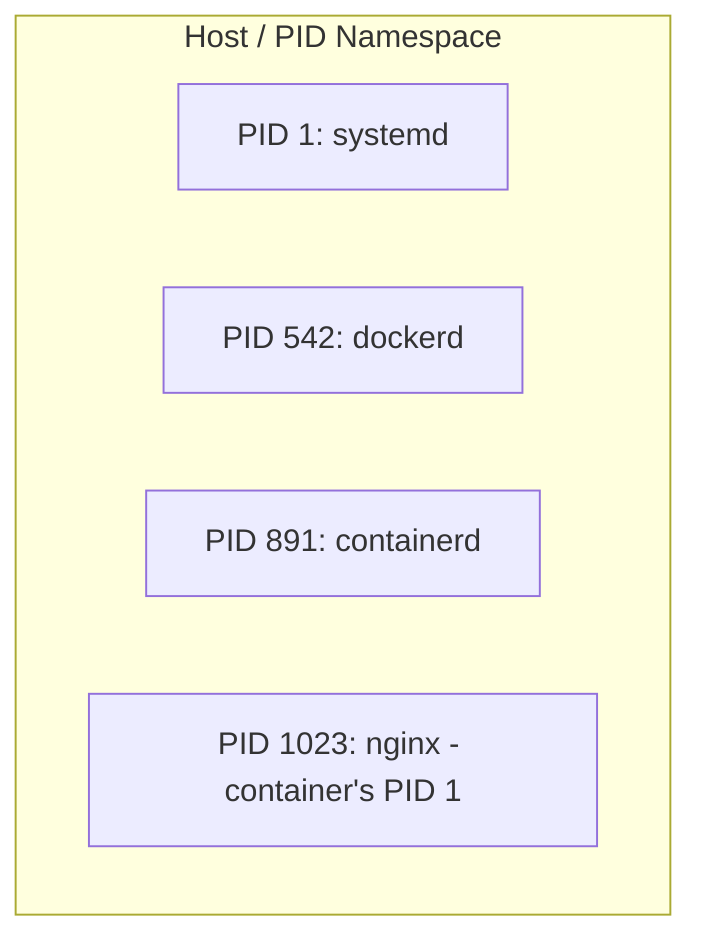
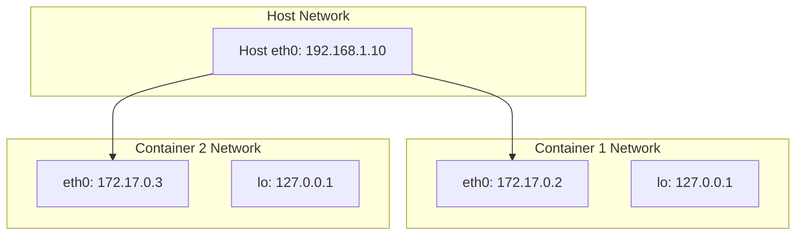
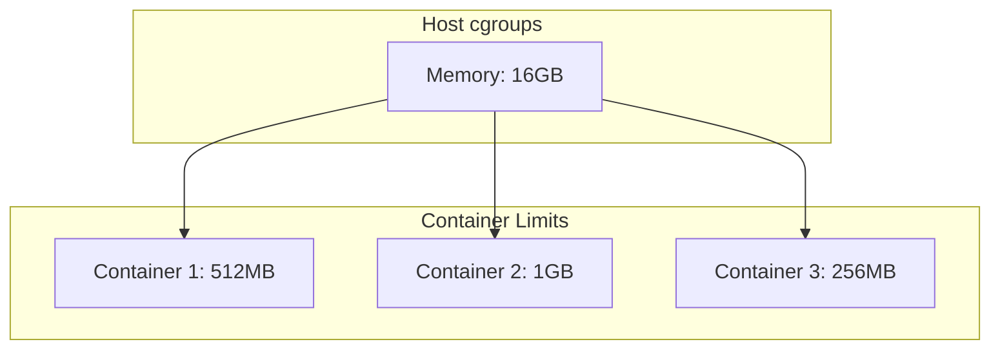
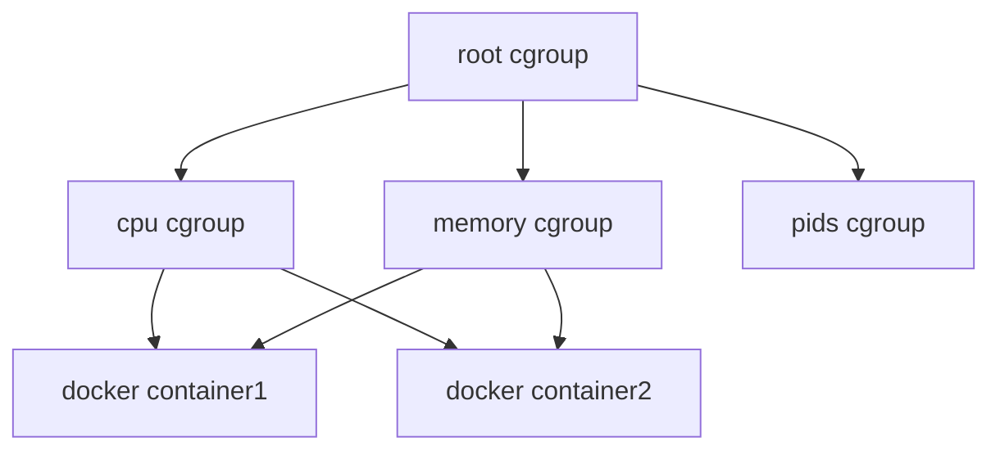
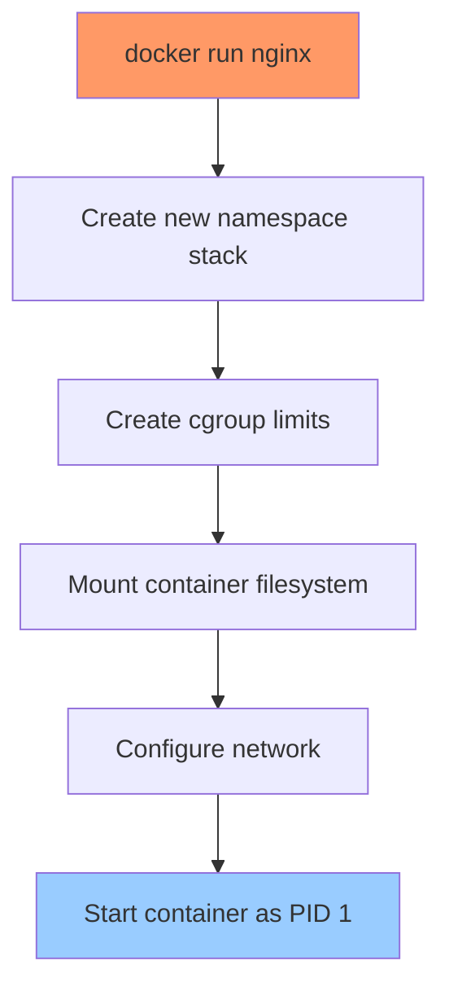
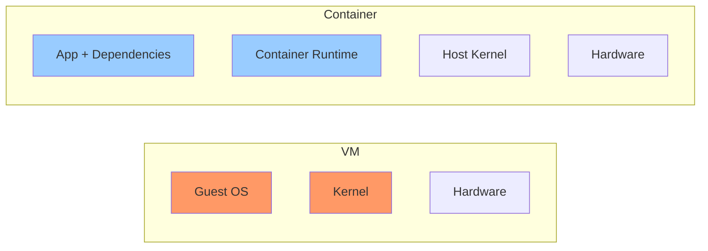

# Lab 03: Underlying Concepts of Linux Containers

## What Are Linux Containers?

Linux containers are lightweight, isolated environments that share the host kernel but maintain process and resource isolation. They are NOT virtual machines - they are just processes running with specialized views of the system.

## The Two Pillars of Container Isolation



## 1. Linux Namespaces

Namespaces partition kernel resources so that each container sees its own independent copy.

### PID Namespace

Containers see their own process tree, starting with PID 1:

```bash
# From inside container
docker exec container ps -ef

# Output shows PID 1 as init of container
root         1     0  0 12:10 ?        00:00:00 nginx: master
www-data     7     1  0 12:10 ?        00:00:00 nginx: worker
```



### Network Namespace

Each container gets its own network stack:

```bash
# Check container's network interfaces
docker exec container ip addr

# Output shows:
# - lo: loopback interface
# - eth0: virtual ethernet to host
# - Container has own IP (e.g., 172.17.0.2)
```



### Mount Namespace

Each container has its own filesystem view:

```bash
# Container sees rootfs, not host's /
docker exec container ls /

# Output:
# bin  dev  etc  home  proc  root  tmp  usr  var
```

### UTS Namespace

Containers can have different hostnames:

```bash
docker run -h myapp.domain.com --name app1 nginx
docker exec app1 hostname

# Output: myapp.domain.com
```

### IPC Namespace

Containers have their own shared memory segments:

```bash
# Each container has isolated IPC
docker exec container ipcs -a
```

### User Namespace

UIDs can be remapped (container root = host non-root):

```bash
# Container root (UID 0) maps to host UID 165536
docker run --privileged docker inspectedocker run nginx cat /proc/1/uid_map
# Output: 0 165536 1
```

## 2. Control Groups (cgroups)

cgroups limit and prioritize resources for containers.

### Resource Limits

```bash
# Set memory limit
docker run -m 512m --name app nginx

# Set CPU limit
docker run --cpus=0.5 --name app nginx

# Check container's cgroup
cat /sys/fs/cgroup/memory/docker/<container-id>/memory.limit_in_bytes
```



### cgroup Hierarchy

```bash
# View cgroup tree
ls -la /sys/fs/cgroup/

# Output:
# /sys/fs/cgroup/cpu/
# /sys/fs/cgroup/memory/
# /sys/fs/cgroup/pids/
# /sys/fs/cgroup/devices/
```



## How Docker Uses These Concepts



## Hands-On Lab

### Step 1: Inspect Namespaces from Host

```bash
# Find container's PID
CONTAINER_ID=$(docker inspect --format '{{.State.Pid}}' container-name)

# View process with namespaces
ls -la /proc/$CONTAINER_ID/ns/

# Output:
# lrwxrwxrwx ... cgroup -> cgroup:[4026531835]
# lrwxrwxrwx ... ipc -> ipc:[4026531839]
# lrwxrwxrwx ... mnt -> mnt:[4026531841]
# lrwxrwxrwx ... net -> net:[4026531840]
# lrwxrwxrwx ... pid -> pid:[4026531836]
# lrwxrwxrwx ... user -> user:[4026531837]
# lrwxrwxrwx ... uts -> uts:[4026531838]
```

### Step 2: Compare Namespaces

```bash
# Host's namespace IDs
ls -la /proc/1/ns/

# Container's namespace IDs
ls -la /proc/$CONTAINER_ID/ns/

# Different values = isolation active
```

### Step 3: Check cgroup Limits

```bash
# Find container's cgroup path
docker inspect --format '{{.Id}}' container-name

# Memory limit
cat /sys/fs/cgroup/memory/docker/$CONTAINER_ID/memory.limit_in_bytes

# CPU shares
cat /sys/fs/cgroup/cpu/docker/$CONTAINER_ID/cpu.shares
```

### Step 4: Verify Process Isolation

```bash
# From HOST: see all PIDs
ps aux | grep nginx

# From CONTAINER: see only container's PIDs
docker exec container-name ps aux
```

## Container vs Virtual Machine



| Aspect | Virtual Machine | Container |
|--------|-----------------|-----------|
| **Boot Time** | Minutes | Seconds |
| **Size** | GB | MB |
| **Isolation** | Full OS | Shared kernel |
| **Start-up** | Boot kernel | Run process |
| **Resource Usage** | High | Low |

## Summary

1. **Namespaces** provide isolation by giving each container its own "view" of system resources
2. **cgroups** enforce limits on how much resource a container can use
3. **Combined**, they make containers lightweight but isolated
4. **Containers share the kernel** - unlike VMs that each have their own OS

## Further Reading

- [Linux Namespace Documentation](https://www.kernel.org/doc/Documentation/namespaces/)
- [cgroup Documentation](https://www.kernel.org/doc/Documentation/cgroup-v2/)
- [Docker Internals](https://docs.docker.com/engine/security/)