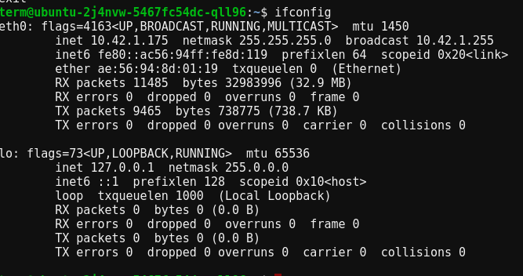

# Network interface : 
#### Network interface is like a connector that connect to your device with Network. 
1. So let’s check the details of network  interface using the ifconfig command:
```bash
ifconfig

```

The eth0 is a physical ethernet interface, and the lo is our loopback interface. We can see that the lo interface has an IP address of 127.0.0.1, with a netmask 255.0.0.0, which is equivalent to /8